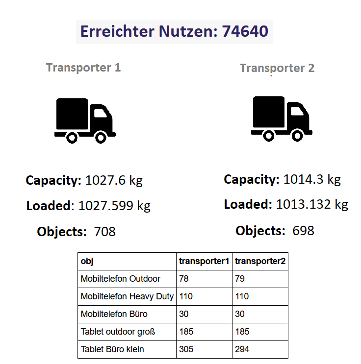

# Code-for-BWI
Code &amp; Win from get in IT

Der Beitrag für die Code-for-BWI Challenge ist als Python Code im Jupyter Notebook eingebunden.

# Beschreibung:

Als input wird der Funktion ein Pandas-Dataframe mit name, anzahl, gewicht und nutzen sowie die zwei Beladungskapazitäten für die Transporter in Gramm (abgezogen die Fahrer) gegeben. Da der Nutzen maximiert werden soll, wird ein score berechnet, der den Nutzen des Objekts pro Gramm wiedergibt. Gemessen an diesem Score werden die Objekte mit dem größten Nutzen pro Gramm als erstes in die Transporter geladen. Da die Nutzen unabhängig voneinander sind, ergeben sich keine Abhängigkeiten (wie zum Beispiel dass sich der Nutzen eines Tablets erhöhen könnte, wenn ein Mobiltelefon dabei ist), und es werden alle Objekte einer Kategorie jeweils geladen, bis die Anzahl erfüllt ist. Die Transporter werden dabei abwechselnd beladen, damit nicht ein Transporter mit leichteren Gegenständen gefüllt ist und im zweiten Platz übrig bleibt, da kein schwerer Gegenstand mehr reinpasst.

# Resultat:
Die optimale Beladung der beiden Transporter nach dem Algorithmus ist in der folgenden Grafik zusammengefasst:

